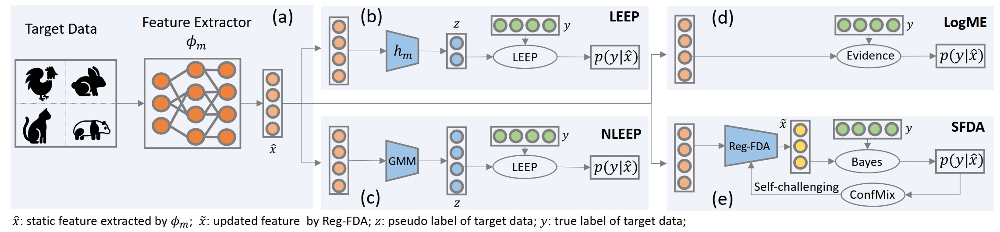

# Not All Models Are Equal: Predicting Model Transferability in a Self-challenging Fisher Space

This is the PyTorch implementation of the paper **Not All Models Are Equal: Predicting Model Transferability in a Self-challenging Fisher Space**


## Self-challenging Fisher Discriminative Analysis (SFDA)
We design a novel model selection method, termed Self-challenging Fisher Discriminative Analysis (SFDA), which is efficient, effective, and robust when measuring the transferability of pre-trained models. Compared with the state-of-the-art method NLEEP, SFDA demonstrates an average of 59.1% gain while bringing 22.5x speedup in wall-clock time.
<div align=center></div>

**Comparisons of weighted Kendall's tau** on 11 downstream classification datasets when selecting 11 pretrained supervised models.

|Method |Aircraft|Caltech101|Cars|CIFAR10|CIFAR100|DTD|Flowers|Food|Pets|SUN397|VOC2007|
| :----:  | :--: |:--: |:--: |:--: |:--: |:--: |:--: |:--: |:--: |:--: |:--: |
| LEEP| -0.234|0.605|0.367|0.824|0.677|0.486|-0.243|0.491|0.389|0.701|0.446|
| LogME |0.506|0.435|**0.576**|0.852|0.692| 0.647| 0.111| 0.385| 0.411| 0.511| 0.478|
| NLEEP | 0.495| 0.661| 0.265| 0.806| 0.823| **0.777**| 0.215| 0.624| 0.599| **0.807**| 0.654|
|PARC   |-0.182| 0.374 |0.562 |0.845| 0.692| 0.642| -0.082| 0.732| 0.138| 0.698| 0.723|
| SFDA  | **0.615**| **0.737**| 0.487| **0.949**| **0.866**| 0.597| **0.542**| **0.815**| **0.734**| 0.703|**0.763**|


## Getting Started
* Install [PyTorch](http://pytorch.org/)
* Clone the repo:
  ```
  git clone https://git.woa.com/wenqishao/SFDA.git
  ```

### Requirements

- Install `PyTorch==1.7.1` and `torchvision==0.8.2` with `CUDA==10.1`:

```bash
conda install pytorch==1.7.1 torchvision==0.8.2 cudatoolkit=10.1 -c pytorch
```

- Install `timm==0.4.9`:

```bash
pip install timm==0.4.9
```

### Data Preparation
- Download the downstream datasets to ./data/*.

### Pipeline of Model selection using transferability
- Fine-tune pretrained models with hyper-paramters sweep to obtain ground-truth transferability score
```
python finetune_group1.py -m resnet50 -d cifar10
```
- Extract features of target data using pretrained models
```
python forward_feature_group1.py -m resnet50 -d cifar10
```
- Compute transferability scores using SFDA
```
python evaluate_metric_group1_cpu.py -me sfda -d cifar10
```
- Assess the effectiveness of SFDA
```
python tw_group1_cpu.py -me sfda -d cifar10
```


